<h1 align="center">Hi, I'm Ashutosh Singh 👋</h1>

<p align="center">
  <strong>Staff / Lead Engineer · Backend · Distributed Systems · AI Agent Systems</strong>
</p>

<p align="center">
  <a href="https://github.com/ashubly25">
    
  </a>
  <a href="https://linkedin.com/in/ashubly25">
    
  </a>
</p>

<p align="center">
  <em>Building reliable systems where architecture, infrastructure, and AI meet.</em>
</p>

---

## 👨‍💻 About Me

I'm a **backend and platform engineer with 7 years of experience**, owning systems end to end — from data models and APIs to infrastructure and AI systems on top.

Currently, I set technical direction for a **multi-tenant healthcare analytics platform** serving **50K+ MAU**, **8K+ DAU**, and **1K+ peak concurrent users** inside a **250+ microservice ecosystem** handling **15M+ API requests/day**. I also lead and mentor engineers while remaining hands-on in the codebase.

My current focus is:

* 🤖 Production **LLM agents & tool orchestration**
* 🏗️ **Distributed systems & scalable backend architecture**
* 🔐 Multi-tenant security and transactional correctness
* ☁️ Kubernetes, cloud infrastructure & GitOps
* ⚡ Performance, concurrency and reliability
* 🧪 Automated testing and production quality

---

## 🚀 Featured Projects

### 🤖 supermarket-ops-agent

**Production LLM agent system for running an Indian kirana store through chat.**

`TypeScript` `Vercel AI SDK` `SQLite` `Telegram` `Docker`

* Autonomous workflows for inventory, GST-correct billing, customer credit, day close, invoices and analysis.
* Model-driven orchestration using `generateText({ tools, stopWhen })` with no intent router or regex dispatch.
* **7 skill playbooks exposing 33 tools** with capability gating.
* Reduced tool-schema tokens by **77%** and total input tokens by **43%**.
* Transactional safeguards for overselling, idempotency, GST calculations and concurrent writes.
* **63-test verification harness** covering correctness, concurrency, replay and cross-session memory.

🔗 [View project](https://github.com/ashubly25/supermarket-ops-agent)

---

### ☁️ backblaze-integrations

**Plakar storage backend for Backblaze B2.**

`Go` `gRPC` `Backblaze B2 Native API v3`

* Implemented storage backend, backup importer and restore exporter.
* Integrated directly with the B2 Native API rather than the S3-compatible gateway.
* Implemented authorization, upload URLs, SHA-1 verification and file-ID based deletes.
* Verified end-to-end with content-hash validation.

🔗 [View project](https://github.com/ashubly25/backblaze-integrations)

---

## 🧠 Engineering Focus

```text
Backend Architecture      ████████████████████
Distributed Systems       ███████████████████░
AI / LLM Agents           ██████████████████░░
Cloud & Infrastructure    █████████████████░░░
Database & Concurrency    ██████████████████░░
Developer Platforms       ███████████████░░░░░
```

---

## 🛠️ Tech Stack

### Languages

`TypeScript` `JavaScript` `Python` `Go` `SQL` `Rust`

### Backend

`Node.js` `FastAPI` `Express` `NestJS` `REST` `GraphQL` `WebSocket` `SSE`

### AI / LLM

`Claude` `OpenAI` `Vercel AI SDK` `Agent Orchestration` `Tool Design` `RAG` `Vector Search` `Structured Outputs`

### Data

`PostgreSQL` `Redis` `MongoDB` `SQLite` `Prisma`

### Distributed Systems

`Kafka` `BullMQ` `Event-Driven Architecture` `Concurrency Control` `Idempotency`

### Infrastructure

`Kubernetes` `Helm` `Docker` `Terraform` `Argo CD` `Azure` `AWS` `Linux`

### Testing

`Pytest` `Vitest` `Playwright` `Jest` `Sentry`

These technologies reflect the stack described in your resume, including your backend, AI, database, infrastructure and testing work.

---

## 📈 Impact

<p align="center">

| Metric                          |            Impact |
| ------------------------------- | ----------------: |
| Monthly Active Users            |          **50K+** |
| Daily Active Users              |           **8K+** |
| Peak Concurrent Users           |           **1K+** |
| API Requests / Day              |          **15M+** |
| Microservices Ecosystem         |          **250+** |
| P95 Latency Improvement         | **900ms → 400ms** |
| Operations Time Reduction       |           **40%** |
| Production Regression Reduction |           **30%** |

</p>

---

## 📊 GitHub

<p align="center">
  
</p>

<p align="center">
  
</p>

> ⚠️ If the public stats service shows **"Error Fetching Resource"**, the README itself is fine; the external stats service is failing. Your GitHub profile does not need to be changed to fix that.

---

## 🌱 Open Source & Community

* Member of **FOSSASIA** and **OpenGenus**
* **GitHub Developer Program**
* **Arctic Code Vault contributor**
* Speaker on **Distributed Systems in Deep Learning** at PyCon Hong Kong 2018 and Wingify DevFest 2018.

---

## 🎯 What I'm Building

I'm particularly interested in systems that combine:

**AI Agents × Distributed Systems × Strong Data Guarantees**

The goal isn't just to make an LLM produce the right answer — it's to build systems where the model operates within **explicit capabilities, typed tools, transactional guarantees, concurrency controls and measurable cost boundaries**.

---

<p align="center">
  <strong>Build systems. Measure them. Make them reliable.</strong>
</p>


# Hey, I'm Ashutosh 👋

Software engineer focused on distributed systems, developer infrastructure, and production-grade AI systems. I build and operate systems end-to-end, from architecture and implementation to deployment and reliability.

## 📊 GitHub Stats

<p align="center">
  
</p>

<p align="center">
  
</p>


<!--
**ashubly25/ashubly25** is a ✨ _special_ ✨ repository because its `README.md` (this file) appears on your GitHub profile.

Here are some ideas to get you started:

- 🔭 I’m currently working on ...
- 🌱 I’m currently learning ...
- 👯 I’m looking to collaborate on ...
- 🤔 I’m looking for help with ...
- 💬 Ask me about ...
- 📫 How to reach me: ...
- 😄 Pronouns: ...
- ⚡ Fun fact: ...
-->
